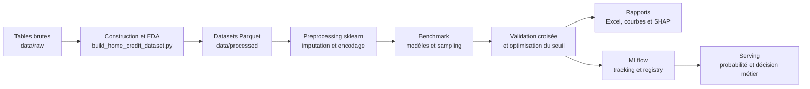

# Home Credit MLOps

Projet de scoring crédit réalisé dans le cadre du parcours MLOps
OpenClassrooms.

L'objectif consiste à estimer la probabilité de défaut d'un demandeur de crédit,
à convertir cette probabilité en décision métier et à assurer la traçabilité du
cycle de vie du modèle avec MLflow.

Le projet adopte une approche **script-first** : la préparation des données,
l'entraînement et l'exploitation MLflow reposent sur des scripts Python
versionnés plutôt que sur des notebooks.

## Objectifs métier et ML

- Consolider les tables Home Credit à la granularité d'un client.
- Nettoyer et enrichir les données sans introduire de fuite de cible.
- Comparer plusieurs familles de modèles et stratégies de rééquilibrage.
- Optimiser les hyperparamètres par validation croisée stratifiée.
- Déterminer un seuil de décision minimisant le coût des erreurs métier.
- Expliquer les prédictions globalement et localement avec SHAP.
- Tracer les expériences, versionner le modèle final et tester son serving avec MLflow.

La classe `TARGET = 1` représente un client en défaut. La configuration actuelle
attribue un coût de `10` à un faux négatif et un coût de `1` à un faux positif.
Cette hypothèse est centralisée dans [`configs/default.toml`](configs/default.toml)
et reste modifiable après validation métier.

## Architecture générale



Le découpage suit un principe simple :

- `scripts/` contient les points d'entrée exécutables ;
- `src/home_credit_mlops/` contient la logique réutilisable, testable et importable.

## Arborescence

```text
home-credit-mlops/
|-- configs/                         # Configuration TOML
|-- data/
|   |-- raw/                         # Données Kaggle non versionnées
|   |-- interim/                     # Données intermédiaires
|   `-- processed/                   # Datasets prêts pour le modèle
|-- docs/                            # Documentation détaillée
|-- scripts/                         # Points d'entrée CLI
|-- src/home_credit_mlops/
|   |-- data/                        # Construction du dataset
|   |-- eda/                         # Diagnostics et visualisations
|   |-- features/                    # Preprocessing sklearn
|   |-- modeling/                    # Modèles, métriques, SHAP et serving
|   `-- reporting/                   # Consolidation des rapports Excel
|-- tests/                           # Tests automatisés
|-- mlflow.db                        # Tracking et registry locaux, non versionnés
|-- mlartifacts/                     # Artefacts MLflow locaux, non versionnés
`-- reports/                         # Livrables générés, non versionnés
```

Une nomenclature détaillée, fichier par fichier, est disponible dans
[`docs/mode_emploi_pipeline_ml.md`](docs/mode_emploi_pipeline_ml.md).

## Prérequis et installation

- WSL 2 avec Ubuntu pour l'environnement de développement actuel ;
- Python `>=3.11,<3.13` ;
- Poetry ;
- fichiers Home Credit placés dans `data/raw/`.

Installation des dépendances depuis WSL :

```bash
cd /home/maxime/projects/home-credit-mlops
poetry install
```

Vérification de l'environnement :

```bash
poetry check
poetry run python --version
poetry run pytest -q
```

Les dossiers `data/raw/`, `data/processed/`, `reports/`, `mlartifacts/` et la
base `mlflow.db` sont exclus de Git. Les données Kaggle et les artefacts lourds
doivent donc être transmis séparément si une reproduction complète est attendue.

## Configuration centrale

Le fichier [`configs/default.toml`](configs/default.toml) centralise notamment :

| Section | Paramètre | Valeur par défaut | Rôle |
|---|---|---:|---|
| `dataset` | `test_size` | `0.2` | Part réservée au holdout |
| `dataset` | `random_state` | `42` | Reproductibilité des découpages |
| `business` | `fn_cost` | `10.0` | Coût d'un mauvais client prédit bon |
| `business` | `fp_cost` | `1.0` | Coût d'un bon client prédit mauvais |
| `business` | `threshold_grid_size` | `401` | Résolution minimale de la recherche de seuil |
| `training` | `cv_folds` | `5` | Nombre de plis de validation croisée |
| `training` | `n_jobs` | `1` | Nombre de processus parallèles |
| `mlflow` | `experiment_name` | `home-credit-scoring` | Nom de l'expérience MLflow |

## Exécution du pipeline

### 1. Construire le dataset et les rapports EDA

```bash
poetry run python scripts/build_home_credit_dataset.py
```

Sorties principales :

- `data/processed/train_features.parquet` ;
- `data/processed/test_features.parquet` ;
- `reports/AAAAMMJJ_home_credit_data_prep/` ;
- `reports/AAAAMMJJ_home_credit_data_prep/AAAAMMJJ_home_credit_data_prep.xlsx`.

### 2. Réaliser un test de développement

```bash
poetry run python scripts/run_home_credit_experiment.py \
  --campaign-name dev_lightgbm_5k_cv3 \
  --model lightgbm \
  --sampling baseline \
  --sample-size 5000 \
  --cv-folds 3 \
  --n-jobs 1
```

Cette commande valide rapidement la chaîne complète sur un échantillon. Sous
WSL, `--n-jobs 1` limite les duplications de mémoire provoquées par la validation
croisée, le preprocessing et le sur-échantillonnage.

### 3. Comparer plusieurs modèles et stratégies de sampling

```bash
poetry run python scripts/run_home_credit_experiment.py \
  --campaign-name benchmark_models_10k_cv3 \
  --model logistic_regression \
  --model random_forest \
  --model extra_trees \
  --model lightgbm \
  --model xgboost \
  --sampling baseline \
  --sampling smote \
  --sample-size 10000 \
  --cv-folds 3 \
  --n-jobs 1
```

Modèles disponibles :

- `logistic_regression` ;
- `random_forest` ;
- `extra_trees` ;
- `lightgbm` ;
- `xgboost`.

Stratégies de rééquilibrage disponibles :

- `baseline` : aucun rééchantillonnage ;
- `smote` : sur-échantillonnage SMOTE ;
- `borderline_smote` : sur-échantillonnage des observations proches de la frontière ;
- `adasyn` : génération adaptative d'observations minoritaires ;
- `smote_under` : combinaison SMOTE et sous-échantillonnage aléatoire.

### 4. Enregistrer un modèle final dans le Model Registry

```bash
poetry run python scripts/run_home_credit_experiment.py \
  --campaign-name champion_lightgbm_smote_full_cv5 \
  --model lightgbm \
  --sampling smote \
  --cv-folds 5 \
  --n-jobs 1 \
  --register-model-name home-credit-scoring
```

Le nom du modèle et la stratégie de sampling de cette commande constituent un
exemple de finalisation. Le choix définitif doit reposer sur les résultats CV de
la campagne de comparaison.

Une fois le champion sélectionné, un enregistrement plus rapide est disponible
pour créer une nouvelle version MLflow sans relancer toute la recherche
d'hyperparamètres :

```bash
poetry run python scripts/register_champion_model.py
```

Ce script réentraîne uniquement le champion connu (`lightgbm + smote`) sur le
dataset préparé, applique le seuil métier `0.220331353025222`, puis enregistre
une version servable dans `home-credit-scoring`.

## Protocole d'évaluation

1. Un holdout stratifié de 20 % est isolé avant l'entraînement.
2. `GridSearchCV` recherche les hyperparamètres avec `StratifiedKFold`.
3. Des probabilités out-of-fold, dites OOF, sont recalculées sur la partie entraînement.
4. Le seuil métier est choisi sur ces probabilités OOF.
5. Les candidats sont classés par coût métier CV, puis par average precision et ROC AUC CV.
6. Le holdout sert uniquement à estimer la généralisation après sélection.
7. Le meilleur pipeline est réentraîné sur l'ensemble des données disponibles.

Le coût métier normalisé est défini par :

```text
coût métier = (10 × FN + 1 × FP) / nombre d'observations
```

Le seuil n'est donc pas fixé arbitrairement à `0.5`. Il minimise le coût métier
sur les probabilités OOF, puis sa performance est contrôlée sur le holdout.

Les métriques suivies comprennent le coût métier, ROC AUC, average precision,
accuracy, balanced accuracy, précision, rappel, F1-score, Brier score, statistique
de Kolmogorov-Smirnov et matrice de confusion.

## Rapports générés

Chaque campagne crée un dossier :

```text
reports/AAAAMMJJ_home_credit_experiments/<horodatage>_<campagne>/
```

Contenu principal :

- `summary.xlsx` : synthèse de la campagne et comparaison des candidats ;
- `cv_results/` : résultats détaillés des recherches d'hyperparamètres ;
- `diagnostics/<candidat>/` : courbes ROC, précision-rappel et matrices de confusion ;
- `predictions/` : probabilités OOF et holdout au format Parquet ;
- `threshold_optimization/` : courbes et tables coût métier contre seuil ;
- `interpretability/` : feature importance et analyses SHAP du meilleur modèle ;
- `decision_threshold.json` : seuil retenu et hypothèses de coût ;
- `campaign_metadata.json` : paramètres et traçabilité de la campagne.

Les tables et graphiques sont consolidés en classeurs Excel afin de limiter la
dispersion des fichiers. Les diagnostics sont produits pour chaque candidat ;
l'interprétabilité détaillée est réservée au modèle sélectionné.

## MLflow

Lancement de l'interface locale :

```bash
poetry run python scripts/mlflow_ui.py
```

L'interface est ensuite accessible sur <http://127.0.0.1:5000>.

MLflow assure :

- le tracking des paramètres, métriques, tags et artefacts ;
- l'organisation d'une campagne en run parent et runs candidats imbriqués ;
- la journalisation des modèles candidats et du modèle final ;
- le versionnement du modèle final dans le Model Registry ;
- le serving local du modèle enregistré.

Un test rapide sans tracking reste possible :

```bash
poetry run python scripts/run_home_credit_experiment.py \
  --model lightgbm \
  --sample-size 3000 \
  --cv-folds 3 \
  --n-jobs 1 \
  --skip-mlflow
```

## Serving de la décision métier

Le modèle final MLflow encapsule le pipeline entraîné et son seuil métier
versionné. Démarrage d'une version enregistrée :

```bash
MODEL_VERSION=3

poetry run mlflow models serve \
  --model-uri "models:/home-credit-scoring/${MODEL_VERSION}" \
  --host 127.0.0.1 \
  --port 8000 \
  --env-manager local
```

Téléchargement de l'exemple d'entrée généré par MLflow :

```bash
poetry run mlflow artifacts download \
  --artifact-uri "models:/home-credit-scoring/${MODEL_VERSION}" \
  --dst-path /tmp/home-credit-serving-demo
```

Appel de l'endpoint depuis un second terminal :

```bash
curl -X POST http://127.0.0.1:8000/invocations \
  -H "Content-Type: application/json" \
  --data @/tmp/home-credit-serving-demo/serving_input_example.json
```

Format de réponse :

```json
{
  "predictions": [
    {
      "default_probability": 0.37,
      "business_threshold": 0.2203,
      "predicted_default": 1,
      "credit_decision": "refused"
    }
  ]
}
```

La valeur `predicted_default = 1` signifie que la probabilité estimée dépasse le
seuil métier. La décision associée est alors `refused`. Une valeur `0` produit
la décision `approved`.

## Qualité et limites

Contrôles disponibles :

```bash
poetry run ruff check scripts src tests
poetry run pytest -q
```

Limites à conserver dans l'analyse :

- le rapport de coût `FN/FP = 10` constitue une hypothèse pédagogique à valider avec le métier ;
- le tracking et le registry reposent actuellement sur une infrastructure locale ;
- la surveillance en production, la dérive des données et la CI/CD restent hors du périmètre actuel ;
- les artefacts locaux et les données brutes ne sont pas stockés dans Git.
