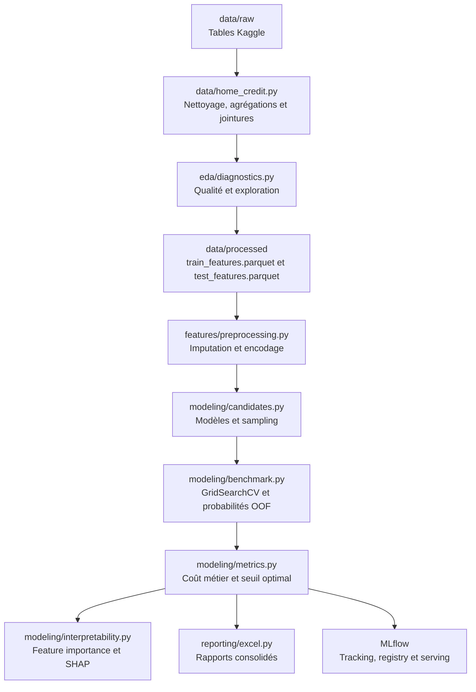

# Mode d'emploi du pipeline Home Credit MLOps

## 1. Finalité du document

Ce document décrit le fonctionnement complet du projet, depuis les tables brutes
Home Credit jusqu'au serving d'une décision de crédit versionnée dans MLflow.

La chaîne répond à quatre objectifs principaux :

- produire un dataset client propre et enrichi ;
- comparer des modèles dans un protocole reproductible ;
- choisir un seuil cohérent avec le coût des erreurs métier ;
- conserver les expériences, modèles et artefacts dans MLflow.

La classe positive `TARGET = 1` correspond au défaut de paiement. Une décision
de crédit repose donc sur la probabilité estimée de cette classe.

## 2. Vue d'ensemble de la chaîne ML



Deux phases restent volontairement séparées :

1. la préparation des données et l'EDA ;
2. l'entraînement, l'évaluation et l'interprétabilité des modèles.

Cette séparation évite de reconstruire toutes les agrégations à chaque expérience
de modélisation.

## 3. Points d'entrée exécutables

### 3.1 Construction du dataset

Point d'entrée : [`scripts/build_home_credit_dataset.py`](../scripts/build_home_credit_dataset.py)

```bash
poetry run python scripts/build_home_credit_dataset.py
```

Le script délègue la logique à
[`src/home_credit_mlops/data/home_credit.py`](../src/home_credit_mlops/data/home_credit.py).

Responsabilités :

- lecture séparée des tables brutes ;
- contrôles de qualité et nettoyage des anomalies connues ;
- création de variables métier ;
- agrégation des tables historiques au niveau `SK_ID_CURR` ;
- jointure des sources sans multiplication des lignes client ;
- suppression documentée des colonnes constantes ;
- export des datasets Parquet ;
- génération du rapport EDA et du classeur Excel associé.

### 3.2 Campagne d'entraînement

Point d'entrée : [`scripts/run_home_credit_experiment.py`](../scripts/run_home_credit_experiment.py)

```bash
poetry run python scripts/run_home_credit_experiment.py \
  --campaign-name dev_lightgbm_5k_cv3 \
  --model lightgbm \
  --sampling baseline \
  --sample-size 5000 \
  --cv-folds 3 \
  --n-jobs 1
```

Le script délègue la logique à
[`src/home_credit_mlops/modeling/benchmark.py`](../src/home_credit_mlops/modeling/benchmark.py).

Responsabilités :

- chargement du dataset préparé ;
- séparation entraînement et holdout ;
- création des pipelines de preprocessing, sampling et classification ;
- recherche d'hyperparamètres ;
- calcul des probabilités OOF ;
- optimisation du seuil métier ;
- comparaison des candidats ;
- diagnostics par candidat ;
- interprétabilité du meilleur modèle ;
- tracking MLflow et enregistrement facultatif dans le Model Registry.

### 3.3 Interface MLflow

Point d'entrée : [`scripts/mlflow_ui.py`](../scripts/mlflow_ui.py)

```bash
poetry run python scripts/mlflow_ui.py
```

L'interface locale est accessible sur <http://127.0.0.1:5000> et permet de
consulter les runs, paramètres, métriques, artefacts et versions enregistrées.

## 4. Environnement et configuration

### 4.1 Environnement Python

Le projet cible Python `>=3.11,<3.13`. Poetry crée l'environnement virtuel,
installe les dépendances et garantit la cohérence avec `poetry.lock`.

```bash
cd /home/maxime/projects/home-credit-mlops
poetry install
poetry run python --version
```

L'exécution doit avoir lieu dans WSL, car l'installation Poetry actuelle se
trouve dans Ubuntu et non dans PowerShell Windows.

### 4.2 Configuration TOML

Le fichier [`configs/default.toml`](../configs/default.toml) constitue la source
de vérité pour les chemins et paramètres transverses.

```toml
[dataset]
test_size = 0.2
random_state = 42

[business]
fn_cost = 10.0
fp_cost = 1.0
threshold_grid_size = 401

[training]
cv_folds = 5
n_jobs = 1
```

Le coût élevé du faux négatif traduit le risque d'accorder un crédit à un client
qui fera défaut. Le faux positif correspond au refus d'un bon client et représente
principalement un manque à gagner.

## 5. Phase 1 : préparation et enrichissement des données

### 5.1 Sources brutes

Les principales sources attendues dans `data/raw/` sont :

- `application_train.csv` : demandes connues avec la cible ;
- `application_test.csv` : demandes sans cible ;
- `bureau.csv` : crédits déclarés par d'autres institutions ;
- `bureau_balance.csv` : historique mensuel des crédits du bureau ;
- `previous_application.csv` : demandes précédentes auprès de Home Credit ;
- `POS_CASH_balance.csv` : historique des crédits POS et cash ;
- `installments_payments.csv` : échéances et paiements ;
- `credit_card_balance.csv` : historique des cartes de crédit.

Les fichiers bruts ne sont pas versionnés dans Git en raison de leur volume et
des conditions de diffusion du jeu de données.

### 5.2 Granularité et clés de jointure

Le dataset final doit contenir une ligne par demandeur identifié par `SK_ID_CURR`.
Les tables secondaires possèdent plusieurs lignes par client et ne peuvent donc
pas être jointes directement à la table principale.

Le traitement suit l'ordre suivant :

1. nettoyage de la table secondaire ;
2. création d'indicateurs pertinents ;
3. agrégation au niveau client ;
4. jointure gauche sur `SK_ID_CURR` ;
5. contrôle du nombre de lignes et du taux de couverture.

Le **taux de couverture** mesure la part des clients de la table principale ayant
au moins une correspondance dans une source secondaire. Un faible taux n'indique
pas nécessairement une erreur : certains clients ne possèdent simplement aucun
historique dans la source concernée.

### 5.3 Nettoyage et feature engineering

[`src/home_credit_mlops/data/home_credit.py`](../src/home_credit_mlops/data/home_credit.py)
centralise :

- le remplacement des valeurs sentinelles ou anomalies identifiées ;
- la création de ratios financiers et temporels ;
- les indicateurs d'existence d'un historique ;
- les agrégations numériques telles que moyenne, minimum, maximum et somme ;
- les agrégations de variables catégorielles encodées ;
- le contrôle des doublons et des colonnes constantes ;
- la traçabilité des jointures et des dimensions de tables.

Les valeurs manquantes ne sont pas supprimées massivement à ce stade. Leur
signification et leur distribution sont documentées, puis leur imputation est
réalisée dans le pipeline de preprocessing afin d'éviter toute fuite entre plis.

### 5.4 EDA et qualité des données

Modules concernés :

- [`src/home_credit_mlops/eda/diagnostics.py`](../src/home_credit_mlops/eda/diagnostics.py) ;
- [`src/home_credit_mlops/eda/visualisation.py`](../src/home_credit_mlops/eda/visualisation.py).

Les rapports comprennent notamment :

- dimensions et types des colonnes ;
- résumés numériques et catégoriels ;
- doublons et colonnes constantes ;
- taux de valeurs manquantes ;
- distribution de `TARGET` ;
- associations entre variables et cible ;
- modalités associées positivement ou négativement au risque ;
- graphiques Missingno et visualisations de synthèse.

Sorties :

```text
data/processed/train_features.parquet
data/processed/test_features.parquet
reports/AAAAMMJJ_home_credit_data_prep/
`-- AAAAMMJJ_home_credit_data_prep.xlsx
```

## 6. Phase 2 : preprocessing sans fuite de données

Module :
[`src/home_credit_mlops/features/preprocessing.py`](../src/home_credit_mlops/features/preprocessing.py)

Le module sépare `X` et `y`, identifie les colonnes par type et construit un
`ColumnTransformer` scikit-learn.

Traitement numérique :

- imputation par la médiane ;
- conservation de l'échelle d'origine.

Traitement catégoriel :

- imputation par la modalité la plus fréquente ;
- encodage One-Hot ;
- tolérance des catégories inconnues avec `handle_unknown="ignore"`.

Le préprocesseur est inclus dans le pipeline du modèle. Chaque pli de validation
croisée ajuste donc ses imputations et catégories uniquement sur son propre jeu
d'entraînement. Ce mécanisme évite une fuite provenant d'un preprocessing ajusté
avant la validation croisée.

## 7. Phase 3 : modèles candidats et déséquilibre

Module :
[`src/home_credit_mlops/modeling/candidates.py`](../src/home_credit_mlops/modeling/candidates.py)

### 7.1 Modèles disponibles

| Identifiant CLI | Famille | Particularité |
|---|---|---|
| `logistic_regression` | Modèle linéaire | Baseline interprétable, classes pondérées |
| `random_forest` | Bagging d'arbres | Non-linéarités et interactions |
| `extra_trees` | Arbres fortement randomisés | Diversité accrue des arbres |
| `lightgbm` | Gradient boosting | Efficace sur données tabulaires |
| `xgboost` | Gradient boosting | Alternative de boosting régularisée |

Chaque spécification contient une fabrique d'estimateur et une grille
d'hyperparamètres compatible avec `GridSearchCV`.

### 7.2 Stratégies de rééquilibrage

| Identifiant CLI | Traitement |
|---|---|
| `baseline` | Aucun rééchantillonnage |
| `smote` | Sur-échantillonnage synthétique de la classe minoritaire |
| `borderline_smote` | SMOTE concentré près de la frontière de décision |
| `adasyn` | Génération adaptative dans les zones difficiles |
| `smote_under` | SMOTE suivi d'un sous-échantillonnage de la classe majoritaire |

Les samplers sont intégrés dans un `imblearn.Pipeline`, après le preprocessing et
avant le modèle. Le rééchantillonnage s'exécute donc uniquement sur les données
d'entraînement de chaque pli. Le holdout n'est jamais rééchantillonné.

Le suffixe du candidat rend la stratégie explicite, par exemple
`lightgbm__smote` ou `xgboost__adasyn`.

## 8. Phase 4 : entraînement et sélection

Module central :
[`src/home_credit_mlops/modeling/benchmark.py`](../src/home_credit_mlops/modeling/benchmark.py)

### 8.1 Découpage initial

Un split stratifié isole 20 % des observations dans un holdout. La stratification
conserve la proportion de défauts dans les deux ensembles.

Rôle des ensembles :

- **train** : recherche d'hyperparamètres, validation croisée et seuil OOF ;
- **holdout** : contrôle final de la généralisation ;
- **test Kaggle** : prédictions finales sans évaluation, car `TARGET` est absent.

### 8.2 Recherche d'hyperparamètres

`GridSearchCV` utilise `StratifiedKFold`, avec mélange des observations et graine
fixe. Le nombre de plis par défaut est `5`.

Le scorer principal maximise l'opposé du coût métier. Les meilleurs
hyperparamètres de chaque candidat sont donc choisis selon l'objectif métier,
et non uniquement selon l'AUC ou l'accuracy.

### 8.3 Probabilités OOF

Après la recherche, `cross_val_predict(..., method="predict_proba")` produit une
probabilité out-of-fold pour chaque observation d'entraînement.

Une probabilité OOF est calculée par un modèle qui n'a pas vu l'observation
concernée pendant son ajustement. Elle fournit ainsi une base plus réaliste pour
optimiser le seuil qu'une probabilité calculée sur les données d'entraînement du
modèle final.

### 8.4 Choix du meilleur candidat

Les candidats sont triés selon :

1. le coût métier CV croissant ;
2. l'average precision CV décroissante ;
3. la ROC AUC CV décroissante.

Le holdout ne participe pas à ce classement. Il conserve son rôle d'estimation
finale de la performance hors échantillon.

### 8.5 Refit final

Après sélection, le pipeline du meilleur candidat est reconstruit avec ses
hyperparamètres et réentraîné sur l'ensemble des données disponibles. Ce pipeline
sert ensuite aux explications SHAP, aux prédictions Kaggle et à l'enregistrement
MLflow.

## 9. Phase 5 : métriques et seuil métier

Module :
[`src/home_credit_mlops/modeling/metrics.py`](../src/home_credit_mlops/modeling/metrics.py)

### 9.1 Fonction de coût

La configuration pédagogique retient :

```text
coût brut = 10 × FN + 1 × FP
coût normalisé = coût brut / nombre d'observations
score métier = - coût normalisé
```

Interprétation :

- `FN` : défaut réel prédit non-défaillant, donc crédit accordé à tort ;
- `FP` : client solvable prédit défaillant, donc crédit refusé à tort.

La minimisation du coût favorise le rappel de la classe défaillante. Une baisse
de précision peut constituer un compromis attendu lorsque le coût des faux
négatifs est nettement supérieur à celui des faux positifs.

### 9.2 Recherche du seuil

Le seuil par défaut de `0.5` n'est pas imposé. La recherche évalue :

- une grille régulière entre `0` et `1` ;
- toutes les probabilités observées ;
- le coût métier de chaque seuil ;
- le rappel comme critère de départage en cas de coût identique.

Le seuil minimisant le coût OOF est ensuite appliqué sans modification au holdout.
La courbe coût métier contre seuil justifie visuellement la décision.

### 9.3 Métriques complémentaires

- `ROC AUC` : capacité générale de classement ;
- `average precision` : qualité du classement de la classe minoritaire ;
- `precision` : part des défauts réels parmi les défauts prédits ;
- `recall` : part des défauts effectivement détectés ;
- `F1` : compromis harmonique entre précision et rappel ;
- `balanced accuracy` : moyenne des rappels par classe ;
- `Brier score` : qualité des probabilités ;
- `KS statistic` : séparation maximale entre distributions de scores ;
- matrice de confusion : volumes de TN, FP, FN et TP.

L'accuracy reste disponible à titre de contrôle, mais son interprétation est
limitée par le fort déséquilibre des classes.

## 10. Phase 6 : interprétabilité

Module :
[`src/home_credit_mlops/modeling/interpretability.py`](../src/home_credit_mlops/modeling/interpretability.py)

Les explications détaillées concernent uniquement le meilleur candidat afin de
limiter le temps de calcul et le volume des rapports.

Sorties principales :

- importance native ou coefficients du modèle ;
- importance regroupée par variable source après One-Hot Encoding ;
- SHAP summary plot global ;
- SHAP bar plot global ;
- SHAP waterfall local pour plusieurs clients ;
- tables de valeurs SHAP consolidées dans `interpretability.xlsx`.

L'analyse globale identifie les variables les plus influentes dans l'ensemble de
la population. L'analyse locale explique pourquoi une probabilité élevée ou
faible a été attribuée à un client particulier.

## 11. Phase 7 : reporting

Module :
[`src/home_credit_mlops/reporting/excel.py`](../src/home_credit_mlops/reporting/excel.py)

Les fichiers CSV, Parquet, JSON et images d'un dossier sont transformés en
onglets d'un classeur Excel. Un onglet `manifest` recense les éléments intégrés.
Les CSV intermédiaires du rapport sont supprimés après consolidation.

### 11.1 Classeur principal

`summary.xlsx` contient notamment :

- `campaign_overview` : paramètres généraux et contexte du run ;
- `model_performance_summary` : comparaison synthétique des candidats ;
- `cv_summary` : résultats de validation croisée et OOF ;
- `holdout_summary` : évaluation finale hors échantillon ;
- `decision_threshold_summary` : seuil et coût métier ;
- `best_model_summary` : synthèse du candidat retenu ;
- `mlflow_runs` : correspondance entre candidats et identifiants MLflow.

### 11.2 Sous-dossiers

```text
reports/AAAAMMJJ_home_credit_experiments/<horodatage>_<campagne>/
|-- summary.xlsx
|-- campaign_metadata.json
|-- decision_threshold.json
|-- cv_results/
|-- diagnostics/
|   |-- logistic_regression/
|   |-- lightgbm__smote/
|   `-- ...
|-- predictions/
|-- threshold_optimization/
`-- interpretability/
```

Les diagnostics ROC, précision-rappel et matrice de confusion sont générés pour
chaque candidat. Les feature importances et SHAP sont générés pour le meilleur
modèle uniquement.

## 12. Phase 8 : MLflow

Module :
[`src/home_credit_mlops/mlflow_utils.py`](../src/home_credit_mlops/mlflow_utils.py)

### 12.1 Tracking des expériences

Une campagne correspond à un run parent. Chaque combinaison modèle et sampling
correspond à un run enfant.

Éléments journalisés :

- paramètres de campagne et hyperparamètres ;
- métriques CV, OOF et holdout ;
- seuil métier et matrice de confusion ;
- tables de prédictions ;
- courbes de diagnostic et rapports Excel ;
- modèle candidat ;
- meilleur modèle final.

Des tags tels que la campagne, le dataset, l'étape et la politique de décision
facilitent la comparaison dans l'interface.

### 12.2 Rôle des stockages locaux

| Emplacement | Contenu |
|---|---|
| `mlflow.db` | Expériences, runs, paramètres, métriques, tags et métadonnées du registry |
| `mlartifacts/` | Artefacts rattachés aux runs : modèles, graphiques, rapports et prédictions |
| `mlartifacts/models/` | Artefacts des logged models gérés par les versions récentes de MLflow |

Le Model Registry n'est donc pas un second dossier de modèles indépendant. Ses
métadonnées et versions se trouvent dans `mlflow.db`, tandis que les fichiers
physiques restent dans `mlartifacts/`.

### 12.3 Model Registry

L'option suivante enregistre le meilleur modèle sous un nom stable :

```bash
--register-model-name home-credit-scoring
```

Chaque nouvel enregistrement crée une version. L'URI
`models:/home-credit-scoring/3`, par exemple, désigne précisément la version 3.

Après sélection du champion, le script suivant permet de créer une nouvelle
version servable sans relancer toute la validation croisée :

```bash
poetry run python scripts/register_champion_model.py
```

Ce point d'entrée reprend le champion validé (`lightgbm + smote`), ses meilleurs
hyperparamètres, le seuil métier `0.220331353025222`, puis réentraîne le pipeline
une seule fois sur le dataset préparé. La version créée dans MLflow contient la
réponse métier complète : probabilité de défaut, seuil, classe prédite et
décision de crédit.

### 12.4 Interface web

```bash
poetry run python scripts/mlflow_ui.py
```

La page <http://127.0.0.1:5000> permet de comparer les runs, consulter les
artefacts et retrouver les versions enregistrées.

## 13. Phase 9 : serving de la décision métier

Module :
[`src/home_credit_mlops/modeling/serving.py`](../src/home_credit_mlops/modeling/serving.py)

`CreditScoringModel` encapsule :

- le pipeline entraîné ;
- le seuil métier sélectionné ;
- la conversion de la probabilité en classe ;
- la conversion de la classe en décision de crédit.

Le seuil fait ainsi partie de la version du modèle. Le serveur ne revient pas au
seuil scikit-learn implicite de `0.5`.

### 13.1 Démarrage du serveur

```bash
MODEL_VERSION=3

poetry run mlflow models serve \
  --model-uri "models:/home-credit-scoring/${MODEL_VERSION}" \
  --host 127.0.0.1 \
  --port 8000 \
  --env-manager local
```

### 13.2 Préparation d'une requête

Le fichier `serving_input_example.json` est généré automatiquement par MLflow à
partir de cinq lignes de features passées à `input_example` lors du logging.
Il respecte le schéma attendu par l'endpoint `/invocations`.

```bash
poetry run mlflow artifacts download \
  --artifact-uri "models:/home-credit-scoring/${MODEL_VERSION}" \
  --dst-path /tmp/home-credit-serving-demo
```

### 13.3 Appel REST

L'appel doit être exécuté dans un second terminal pendant que le serveur reste actif.

```bash
curl -X POST http://127.0.0.1:8000/invocations \
  -H "Content-Type: application/json" \
  --data @/tmp/home-credit-serving-demo/serving_input_example.json
```

Réponse MLflow :

```json
{
  "predictions": [
    {
      "default_probability": 0.37,
      "business_threshold": 0.2203,
      "predicted_default": 1,
      "credit_decision": "refused"
    }
  ]
}
```

Le tableau `predictions` contient une réponse par ligne d'entrée. Les champs
`refused` et `approved` fournissent une représentation directement exploitable
par une future API métier.

## 14. Nomenclature fichier par fichier

### Points d'entrée

| Fichier | Rôle |
|---|---|
| [`scripts/build_home_credit_dataset.py`](../scripts/build_home_credit_dataset.py) | Lance la préparation et l'EDA |
| [`scripts/run_home_credit_experiment.py`](../scripts/run_home_credit_experiment.py) | Lance une campagne de benchmark |
| [`scripts/register_champion_model.py`](../scripts/register_champion_model.py) | Réentraîne et enregistre rapidement le champion MLflow |
| [`scripts/mlflow_ui.py`](../scripts/mlflow_ui.py) | Lance l'interface MLflow locale |

### Socle applicatif

| Fichier | Rôle |
|---|---|
| [`src/home_credit_mlops/settings.py`](../src/home_credit_mlops/settings.py) | Charge et type la configuration TOML |
| [`src/home_credit_mlops/logging_utils.py`](../src/home_credit_mlops/logging_utils.py) | Configure les logs Python |
| [`src/home_credit_mlops/mlflow_utils.py`](../src/home_credit_mlops/mlflow_utils.py) | Configure MLflow, le registry et l'UI |

### Données et EDA

| Fichier | Rôle |
|---|---|
| [`src/home_credit_mlops/data/io.py`](../src/home_credit_mlops/data/io.py) | Centralise les lectures et écritures tabulaires |
| [`src/home_credit_mlops/data/home_credit.py`](../src/home_credit_mlops/data/home_credit.py) | Nettoie, agrège, joint et exporte le dataset |
| [`src/home_credit_mlops/eda/diagnostics.py`](../src/home_credit_mlops/eda/diagnostics.py) | Produit les audits de qualité et rapports EDA |
| [`src/home_credit_mlops/eda/visualisation.py`](../src/home_credit_mlops/eda/visualisation.py) | Produit les graphiques et associations avec la cible |

### Modélisation

| Fichier | Rôle |
|---|---|
| [`src/home_credit_mlops/features/preprocessing.py`](../src/home_credit_mlops/features/preprocessing.py) | Construit le `ColumnTransformer` |
| [`src/home_credit_mlops/modeling/candidates.py`](../src/home_credit_mlops/modeling/candidates.py) | Définit modèles, grilles et sampling |
| [`src/home_credit_mlops/modeling/metrics.py`](../src/home_credit_mlops/modeling/metrics.py) | Calcule les métriques et optimise le seuil |
| [`src/home_credit_mlops/modeling/benchmark.py`](../src/home_credit_mlops/modeling/benchmark.py) | Orchestre entraînement, sélection et exports |
| [`src/home_credit_mlops/modeling/interpretability.py`](../src/home_credit_mlops/modeling/interpretability.py) | Produit feature importance et SHAP |
| [`src/home_credit_mlops/modeling/serving.py`](../src/home_credit_mlops/modeling/serving.py) | Retourne probabilité, seuil et décision métier |
| [`src/home_credit_mlops/reporting/excel.py`](../src/home_credit_mlops/reporting/excel.py) | Regroupe les artefacts en classeurs Excel |

### Tests

Le dossier `tests/` couvre notamment les métriques métier, la recherche de seuil,
les stratégies de sampling, les rapports, le workflow de benchmark et la réponse
du modèle de serving.

```bash
poetry run ruff check scripts src tests
poetry run pytest -q
```

## 15. Scénarios d'utilisation

### Modification de la préparation des données

1. Adapter `src/home_credit_mlops/data/home_credit.py`.
2. Reconstruire les datasets avec `build_home_credit_dataset.py`.
3. Contrôler le classeur `home_credit_data_prep.xlsx`.
4. Relancer une campagne de modèles sur un échantillon.
5. Comparer la nouvelle campagne à la référence dans MLflow.

### Modification d'un modèle ou de sa grille

1. Adapter `src/home_credit_mlops/modeling/candidates.py`.
2. Lancer une campagne courte sur échantillon et trois plis.
3. Contrôler `summary.xlsx` et les diagnostics.
4. Lancer une campagne complète uniquement après validation du test court.

### Exécution rapide sans MLflow

```bash
poetry run python scripts/run_home_credit_experiment.py \
  --model lightgbm \
  --sample-size 3000 \
  --cv-folds 3 \
  --n-jobs 1 \
  --skip-mlflow
```

### Campagne finale avec enregistrement

```bash
poetry run python scripts/run_home_credit_experiment.py \
  --campaign-name champion_final_full_cv5 \
  --model lightgbm \
  --sampling smote \
  --cv-folds 5 \
  --n-jobs 1 \
  --register-model-name home-credit-scoring
```

Le recours à `--n-jobs 1` est recommandé pour les campagnes lourdes sous WSL.
Les processus parallèles dupliquent les matrices transformées et les jeux
sur-échantillonnés, ce qui peut saturer la mémoire malgré un nombre élevé de CPU.

## 16. Trame de présentation du pipeline

Une présentation synthétique peut suivre cette narration :

> Le projet commence par consolider les tables Home Credit à la granularité du
> client. Le nettoyage, le feature engineering et l'EDA produisent ensuite deux
> datasets Parquet reproductibles. Le preprocessing est intégré aux pipelines
> afin d'éviter les fuites pendant la validation croisée. Plusieurs modèles et
> stratégies de rééquilibrage sont comparés selon un coût métier qui pénalise dix
> fois plus les faux négatifs. Le seuil de décision est optimisé sur des
> probabilités OOF, puis contrôlé sur un holdout indépendant. Le meilleur modèle
> reçoit enfin des explications globales et locales avec SHAP. MLflow conserve
> les paramètres, métriques, artefacts et versions, puis expose une réponse
> contenant la probabilité de défaut, le seuil versionné et la décision de crédit.

## 17. Points de vigilance

- Le rapport `FN/FP = 10` reste une hypothèse pédagogique à faire valider par le métier.
- Le holdout doit rester absent de la sélection des modèles et des seuils.
- Le sampling doit rester à l'intérieur de la validation croisée.
- Les résultats supérieurs aux références Kaggle doivent déclencher un audit de fuite de données.
- Le tracking local n'apporte ni haute disponibilité ni collaboration distante.
- La surveillance de dérive, la CI/CD et le déploiement cloud constituent des prolongements possibles.
