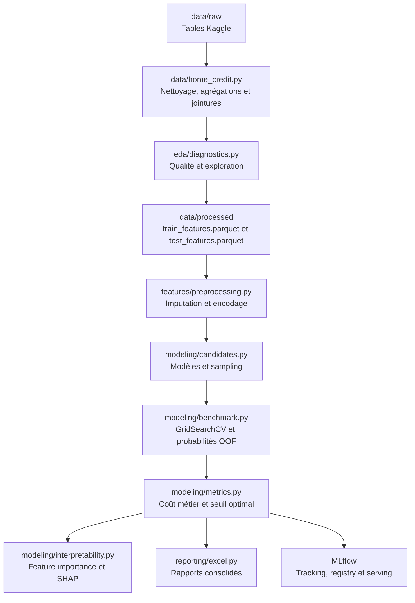

# Mode d'emploi du pipeline Home Credit MLOps

## 1. Finalité du document

Ce document décrit le fonctionnement complet du projet, depuis les tables brutes
Home Credit jusqu'au serving d'une décision de crédit versionnée dans MLflow.

La chaîne répond à quatre objectifs principaux :

- produire un dataset client propre et enrichi ;
- comparer des modèles dans un protocole reproductible ;
- choisir un seuil cohérent avec le coût des erreurs métier ;
- conserver les expériences, modèles et artefacts dans MLflow.

La classe positive `TARGET = 1` correspond au défaut de paiement. Une décision
de crédit repose donc sur la probabilité estimée de cette classe.

## 2. Vue d'ensemble de la chaîne ML


```mermaid
flowchart TD
    A["data/raw<br/>Tables Kaggle"] --> B["data/home_credit.py<br/>Nettoyage, agrégations et jointures"]
    B --> C["eda/diagnostics.py<br/>Qualité et exploration"]
    C --> D["data/processed<br/>train_features.parquet et test_features.parquet"]
    D --> E["features/preprocessing.py<br/>Imputation et encodage"]
    E --> F["modeling/candidates.py<br/>Modèles et sampling"]
    F --> G["modeling/benchmark.py<br/>GridSearchCV et probabilités OOF"]
    G --> H["modeling/metrics.py<br/>Coût métier et seuil optimal"]
    H --> I["modeling/interpretability.py<br/>Feature importance et SHAP"]
    H --> J["reporting/excel.py<br/>Rapports consolidés"]
    H --> K["MLflow<br/>Tracking, registry et serving"]
```

Deux phases restent volontairement séparées :

1. la préparation des données et l'EDA ;
2. l'entraînement, l'évaluation et l'interprétabilité des modèles.

Cette séparation évite de reconstruire toutes les agrégations à chaque expérience
de modélisation.

## 3. Points d'entrée exécutables

### 3.1 Construction du dataset

Point d'entrée : [`scripts/build_home_credit_dataset.py`](../scripts/build_home_credit_dataset.py)

```bash
poetry run python scripts/build_home_credit_dataset.py
```

Le script délègue la logique à
[`src/home_credit_mlops/data/home_credit.py`](../src/home_credit_mlops/data/home_credit.py).

Responsabilités :

- lecture séparée des tables brutes ;
- contrôles de qualité et nettoyage des anomalies connues ;
- création de variables métier ;
- agrégation des tables historiques au niveau `SK_ID_CURR` ;
- jointure des sources sans multiplication des lignes client ;
- suppression documentée des colonnes constantes ;
- export des datasets Parquet ;
- génération du rapport EDA et du classeur Excel associé.

### 3.2 Campagne d'entraînement

Point d'entrée : [`scripts/run_home_credit_experiment.py`](../scripts/run_home_credit_experiment.py)

```bash
poetry run python scripts/run_home_credit_experiment.py \
  --campaign-name dev_lightgbm_5k_cv3 \
  --model lightgbm \
  --sampling baseline \
  --sample-size 5000 \
  --cv-folds 3 \
  --n-jobs 1
```

Le script délègue la logique à
[`src/home_credit_mlops/modeling/benchmark.py`](../src/home_credit_mlops/modeling/benchmark.py).

Responsabilités :

- chargement du dataset préparé ;
- séparation entraînement et holdout ;
- création des pipelines de preprocessing, sampling et classification ;
- recherche d'hyperparamètres ;
- calcul des probabilités OOF ;
- optimisation du seuil métier ;
- comparaison des candidats ;
- diagnostics par candidat ;
- interprétabilité du meilleur modèle ;
- tracking MLflow et enregistrement facultatif dans le Model Registry.

### 3.3 Interface MLflow

Point d'entrée : [`scripts/mlflow_ui.py`](../scripts/mlflow_ui.py)

```bash
poetry run python scripts/mlflow_ui.py
```

L'interface locale est accessible sur <http://127.0.0.1:5000> et permet de
consulter les runs, paramètres, métriques, artefacts et versions enregistrées.

## 4. Environnement et configuration

### 4.1 Environnement Python

Le projet cible Python `>=3.11,<3.13`. Poetry crée l'environnement virtuel,
installe les dépendances et garantit la cohérence avec `poetry.lock`.

```bash
cd /home/maxime/projects/home-credit-mlops
poetry install
poetry run python --version
```

L'exécution doit avoir lieu dans WSL, car l'installation Poetry actuelle se
trouve dans Ubuntu et non dans PowerShell Windows.

Les dépendances sont réparties en groupes Poetry : `main` (calcul/inférence
toujours nécessaire — pandas, scikit-learn, mlflow, lightgbm, xgboost,
imbalanced-learn), `reporting` (matplotlib, seaborn, shap, missingno,
openpyxl — EDA et rapports, pas nécessaire à l'API), `api` (fastapi,
huggingface_hub, pydantic) et `dev` (pytest, ruff, httpx2). `poetry install`
sans option installe tous les groupes ; l'image Docker de l'API n'installe
que `main` et `api` (`poetry install --only main,api`) pour rester légère
(voir section 15.5).

### 4.2 Configuration TOML

Le fichier [`configs/default.toml`](../configs/default.toml) constitue la source
de vérité pour les chemins et paramètres transverses.

```toml
[dataset]
test_size = 0.2
random_state = 42

[business]
fn_cost = 10.0
fp_cost = 1.0
threshold_grid_size = 401

[training]
cv_folds = 5
n_jobs = 1

[serving]
model_repo_id = "<compte-hf>/home-credit-scoring"
revision = "main"
local_cache_dir = "artifacts/hf_model_cache"
```

Le coût élevé du faux négatif traduit le risque d'accorder un crédit à un client
qui fera défaut. Le faux positif correspond au refus d'un bon client et représente
principalement un manque à gagner.

## 5. Phase 1 : préparation et enrichissement des données

### 5.1 Sources brutes

Les principales sources attendues dans `data/raw/` sont :

- `application_train.csv` : demandes connues avec la cible ;
- `application_test.csv` : demandes sans cible ;
- `bureau.csv` : crédits déclarés par d'autres institutions ;
- `bureau_balance.csv` : historique mensuel des crédits du bureau ;
- `previous_application.csv` : demandes précédentes auprès de Home Credit ;
- `POS_CASH_balance.csv` : historique des crédits POS et cash ;
- `installments_payments.csv` : échéances et paiements ;
- `credit_card_balance.csv` : historique des cartes de crédit.

Les fichiers bruts ne sont pas versionnés dans Git en raison de leur volume et
des conditions de diffusion du jeu de données.

### 5.2 Granularité et clés de jointure

Le dataset final doit contenir une ligne par demandeur identifié par `SK_ID_CURR`.
Les tables secondaires possèdent plusieurs lignes par client et ne peuvent donc
pas être jointes directement à la table principale.

Le traitement suit l'ordre suivant :

1. nettoyage de la table secondaire ;
2. création d'indicateurs pertinents ;
3. agrégation au niveau client ;
4. jointure gauche sur `SK_ID_CURR` ;
5. contrôle du nombre de lignes et du taux de couverture.

Le **taux de couverture** mesure la part des clients de la table principale ayant
au moins une correspondance dans une source secondaire. Un faible taux n'indique
pas nécessairement une erreur : certains clients ne possèdent simplement aucun
historique dans la source concernée.

### 5.3 Nettoyage et feature engineering

[`src/home_credit_mlops/data/home_credit.py`](../src/home_credit_mlops/data/home_credit.py)
centralise :

- le remplacement des valeurs sentinelles ou anomalies identifiées ;
- la création de ratios financiers et temporels ;
- les indicateurs d'existence d'un historique ;
- les agrégations numériques telles que moyenne, minimum, maximum et somme ;
- les agrégations de variables catégorielles encodées ;
- le contrôle des doublons et des colonnes constantes ;
- la traçabilité des jointures et des dimensions de tables.

#### Politique de gestion des doublons

`load_raw_table()` (dans `data/home_credit.py`) charge chaque table brute et
distingue explicitement deux notions, sinon faciles à confondre :

- **doublons de lignes strictement identiques** (toutes colonnes égales) :
  ce sont de vrais doublons de saisie. Ils sont automatiquement supprimés au
  chargement, et le nombre de lignes retirées par table est enregistré dans
  `dataset_metadata.json` (clé `duplicate_rows_removed`) ainsi que dans
  `table_profiles.csv` (colonne `full_row_duplicates_removed`) ;
- **répétition d'une clé métier** (`SK_ID_CURR`, `SK_ID_PREV`,
  `SK_ID_BUREAU`...) : ces tables sont *event-level*, un même client ou un
  même prêt a normalement plusieurs lignes (plusieurs crédits bureau,
  plusieurs échéances, etc.). Ce n'est pas un doublon et ces lignes ne sont
  **jamais** supprimées. Le nombre de répétitions est seulement rapporté à
  titre informatif dans `table_profiles.csv` (colonnes `*_key_repetitions`).

Vérification empirique sur l'export Kaggle utilisé dans ce projet : aucune
des tables brutes (`application_train`, `application_test`, `bureau`,
`bureau_balance`, `previous_application`, `POS_CASH_balance`,
`credit_card_balance`, `installments_payments`) ne contient de ligne
strictement dupliquée. La suppression automatique reste néanmoins active
comme filet de sécurité en cas de changement de source de données.

Les valeurs manquantes ne sont pas supprimées massivement à ce stade. Leur
signification et leur distribution sont documentées, puis leur imputation est
réalisée dans le pipeline de preprocessing afin d'éviter toute fuite entre plis.

### 5.4 EDA et qualité des données

Modules concernés :

- [`src/home_credit_mlops/eda/diagnostics.py`](../src/home_credit_mlops/eda/diagnostics.py) ;
- [`src/home_credit_mlops/eda/visualisation.py`](../src/home_credit_mlops/eda/visualisation.py).

Les rapports comprennent notamment :

- dimensions et types des colonnes ;
- résumés numériques et catégoriels ;
- doublons et colonnes constantes ;
- taux de valeurs manquantes ;
- distribution de `TARGET` ;
- associations entre variables et cible ;
- modalités associées positivement ou négativement au risque ;
- graphiques Missingno et visualisations de synthèse.

Sorties :

```text
data/processed/train_features.parquet
data/processed/test_features.parquet
reports/AAAAMMJJ_home_credit_data_prep/
`-- AAAAMMJJ_home_credit_data_prep.xlsx
```

## 6. Phase 2 : preprocessing sans fuite de données

Module :
[`src/home_credit_mlops/features/preprocessing.py`](../src/home_credit_mlops/features/preprocessing.py)

Le module sépare `X` et `y`, identifie les colonnes par type et construit un
`ColumnTransformer` scikit-learn.

Traitement numérique :

- imputation par la médiane ;
- conservation de l'échelle d'origine.

Traitement catégoriel :

- imputation par la modalité la plus fréquente ;
- encodage One-Hot ;
- tolérance des catégories inconnues avec `handle_unknown="ignore"`.

Le préprocesseur est inclus dans le pipeline du modèle. Chaque pli de validation
croisée ajuste donc ses imputations et catégories uniquement sur son propre jeu
d'entraînement. Ce mécanisme évite une fuite provenant d'un preprocessing ajusté
avant la validation croisée.

## 7. Phase 3 : modèles candidats et déséquilibre

Module :
[`src/home_credit_mlops/modeling/candidates.py`](../src/home_credit_mlops/modeling/candidates.py)

### 7.1 Modèles disponibles

| Identifiant CLI | Famille | Particularité |
|---|---|---|
| `logistic_regression` | Modèle linéaire | Baseline interprétable, classes pondérées |
| `random_forest` | Bagging d'arbres | Non-linéarités et interactions |
| `extra_trees` | Arbres fortement randomisés | Diversité accrue des arbres |
| `lightgbm` | Gradient boosting | Efficace sur données tabulaires |
| `xgboost` | Gradient boosting | Alternative de boosting régularisée ; `scale_pos_weight` calculé dynamiquement (voir ci-dessous) |
| `mlp` | Réseau de neurones (`MLPClassifier`) | Sensible à l'échelle : une standardisation (`StandardScaler`) est insérée automatiquement dans son pipeline, contrairement aux modèles à base d'arbres |

Chaque spécification contient une fabrique d'estimateur et une grille
d'hyperparamètres compatible avec `GridSearchCV`. Le flag interne
`requires_scaling` (porté par `ModelSpec`) déclenche cette standardisation
uniquement pour les modèles qui en ont besoin ; les modèles à base d'arbres
n'en sont pas affectés.

#### Cas particulier XGBoost : `scale_pos_weight`

Contrairement aux autres modèles, `XGBClassifier` ne supporte pas
`class_weight`. Sans correction, il tournait donc sans aucune gestion du
déséquilibre en sampling `baseline`, contrairement à tous les autres
candidats — un biais dans la comparaison entre modèles.

`ModelSpec.scale_pos_weight_param` (renseigné à `"scale_pos_weight"` pour
XGBoost) déclenche, dans `build_model_pipeline`, le calcul du ratio
négatifs/positifs sur le `target` d'entraînement, appliqué au modèle avant
le fit. Ce calcul n'est effectué **qu'en sampling `baseline`** : dès qu'un
sur-échantillonnage (SMOTE, ADASYN...) tourne dans le pipeline, les classes
vues par le modèle sont déjà quasi équilibrées, et figer `scale_pos_weight`
sur le ratio d'origine ferait double correction. Les autres modèles n'ont
pas ce problème car `class_weight="balanced"` est recalculé par scikit-learn
au moment du fit, donc automatiquement sur les données déjà rééquilibrées.

Le MLP ne supporte pas nativement `class_weight` : le déséquilibre des
classes doit être géré via une stratégie de sampling (`--sampling smote`,
par exemple) plutôt que par pondération.

### 7.2 Stratégies de rééquilibrage

| Identifiant CLI | Traitement |
|---|---|
| `baseline` | Aucun rééchantillonnage |
| `smote` | Sur-échantillonnage synthétique de la classe minoritaire |
| `borderline_smote` | SMOTE concentré près de la frontière de décision |
| `adasyn` | Génération adaptative dans les zones difficiles |
| `smote_under` | SMOTE suivi d'un sous-échantillonnage de la classe majoritaire |

Les samplers sont intégrés dans un `imblearn.Pipeline`, après le preprocessing et
avant le modèle. Le rééchantillonnage s'exécute donc uniquement sur les données
d'entraînement de chaque pli. Le holdout n'est jamais rééchantillonné.

Le suffixe du candidat rend la stratégie explicite, par exemple
`lightgbm__smote` ou `xgboost__adasyn`.

## 8. Phase 4 : entraînement et sélection

Module central :
[`src/home_credit_mlops/modeling/benchmark.py`](../src/home_credit_mlops/modeling/benchmark.py)

### 8.1 Découpage initial

Un split stratifié isole 20 % des observations dans un holdout. La stratification
conserve la proportion de défauts dans les deux ensembles.

Rôle des ensembles :

- **train** : recherche d'hyperparamètres, validation croisée et seuil OOF ;
- **holdout** : contrôle final de la généralisation ;
- **test Kaggle** : prédictions finales sans évaluation, car `TARGET` est absent.

### 8.2 Recherche d'hyperparamètres

`GridSearchCV` utilise `StratifiedKFold`, avec mélange des observations et graine
fixe. Le nombre de plis par défaut est `5`.

Le scorer principal maximise l'opposé du coût métier. Les meilleurs
hyperparamètres de chaque candidat sont donc choisis selon l'objectif métier,
et non uniquement selon l'AUC ou l'accuracy.

### 8.3 Probabilités OOF

Après la recherche, `cross_val_predict(..., method="predict_proba")` produit une
probabilité out-of-fold pour chaque observation d'entraînement.

Une probabilité OOF est calculée par un modèle qui n'a pas vu l'observation
concernée pendant son ajustement. Elle fournit ainsi une base plus réaliste pour
optimiser le seuil qu'une probabilité calculée sur les données d'entraînement du
modèle final.

### 8.4 Choix du meilleur candidat

Les candidats sont triés selon :

1. le coût métier CV croissant ;
2. l'average precision CV décroissante ;
3. la ROC AUC CV décroissante.

Le holdout ne participe pas à ce classement. Il conserve son rôle d'estimation
finale de la performance hors échantillon.

### 8.5 Refit final

Après sélection, le pipeline du meilleur candidat est reconstruit avec ses
hyperparamètres et réentraîné sur l'ensemble des données disponibles. Ce pipeline
sert ensuite aux explications SHAP, aux prédictions Kaggle et à l'enregistrement
MLflow.

## 9. Phase 5 : métriques et seuil métier

Module :
[`src/home_credit_mlops/modeling/metrics.py`](../src/home_credit_mlops/modeling/metrics.py)

### 9.1 Fonction de coût

La configuration pédagogique retient :

```text
coût brut = 10 × FN + 1 × FP
coût normalisé = coût brut / nombre d'observations
score métier = - coût normalisé
```

Interprétation :

- `FN` : défaut réel prédit non-défaillant, donc crédit accordé à tort ;
- `FP` : client solvable prédit défaillant, donc crédit refusé à tort.

La minimisation du coût favorise le rappel de la classe défaillante. Une baisse
de précision peut constituer un compromis attendu lorsque le coût des faux
négatifs est nettement supérieur à celui des faux positifs.

### 9.2 Recherche du seuil

Le seuil par défaut de `0.5` n'est pas imposé. La recherche évalue :

- une grille régulière entre `0` et `1` ;
- toutes les probabilités observées ;
- le coût métier de chaque seuil ;
- le rappel comme critère de départage en cas de coût identique.

Le seuil minimisant le coût OOF est ensuite appliqué sans modification au holdout.
La courbe coût métier contre seuil justifie visuellement la décision.

### 9.3 Métriques complémentaires

- `ROC AUC` : capacité générale de classement ;
- `average precision` : qualité du classement de la classe minoritaire ;
- `precision` : part des défauts réels parmi les défauts prédits ;
- `recall` : part des défauts effectivement détectés ;
- `F1` : compromis harmonique entre précision et rappel ;
- `balanced accuracy` : moyenne des rappels par classe ;
- `Brier score` : qualité des probabilités ;
- `KS statistic` : séparation maximale entre distributions de scores ;
- matrice de confusion : volumes de TN, FP, FN et TP.

L'accuracy reste disponible à titre de contrôle, mais son interprétation est
limitée par le fort déséquilibre des classes.

## 10. Phase 6 : interprétabilité

Module :
[`src/home_credit_mlops/modeling/interpretability.py`](../src/home_credit_mlops/modeling/interpretability.py)

Les explications détaillées concernent uniquement le meilleur candidat afin de
limiter le temps de calcul et le volume des rapports.

Sorties principales :

- importance native ou coefficients du modèle ;
- importance regroupée par variable source après One-Hot Encoding ;
- SHAP summary plot global ;
- SHAP bar plot global ;
- SHAP waterfall local pour plusieurs clients ;
- tables de valeurs SHAP consolidées dans `interpretability.xlsx`.

L'analyse globale identifie les variables les plus influentes dans l'ensemble de
la population. L'analyse locale explique pourquoi une probabilité élevée ou
faible a été attribuée à un client particulier.

L'explainer SHAP est choisi selon le type de modèle du meilleur candidat :
`TreeExplainer` pour les modèles à base d'arbres/boosting, `LinearExplainer`
pour les modèles linéaires, et un explainer générique (`shap.Explainer` sur
`predict_proba`, plus lent mais borné par `--shap-sample-size`) pour les
modèles sans structure interne exploitable comme le MLP. De même, si le
meilleur candidat n'expose ni `feature_importances_` ni `coef_`, l'export
d'importance native est simplement ignoré (avertissement en log) : l'importance
globale reste disponible via les valeurs SHAP moyennes.

## 11. Phase 7 : reporting

Module :
[`src/home_credit_mlops/reporting/excel.py`](../src/home_credit_mlops/reporting/excel.py)

Les fichiers CSV, Parquet, JSON et images d'un dossier sont transformés en
onglets d'un classeur Excel. Un onglet `manifest` recense les éléments intégrés.
Les CSV intermédiaires du rapport sont supprimés après consolidation.

### 11.1 Classeur principal

`summary.xlsx` contient notamment :

- `campaign_overview` : paramètres généraux et contexte du run ;
- `model_performance_summary` : comparaison synthétique des candidats ;
- `cv_summary` : résultats de validation croisée et OOF ;
- `holdout_summary` : évaluation finale hors échantillon ;
- `decision_threshold_summary` : seuil et coût métier ;
- `best_model_summary` : synthèse du candidat retenu ;
- `mlflow_runs` : correspondance entre candidats et identifiants MLflow.

### 11.2 Sous-dossiers

```text
reports/AAAAMMJJ_home_credit_experiments/<horodatage>_<campagne>/
|-- summary.xlsx
|-- campaign_metadata.json
|-- decision_threshold.json
|-- cv_results/
|-- diagnostics/
|   |-- logistic_regression/
|   |-- lightgbm__smote/
|   `-- ...
|-- predictions/
|-- threshold_optimization/
`-- interpretability/
```

Les diagnostics ROC, précision-rappel et matrice de confusion sont générés pour
chaque candidat. Les feature importances et SHAP sont générés pour le meilleur
modèle uniquement.

## 12. Phase 8 : MLflow

Module :
[`src/home_credit_mlops/mlflow_utils.py`](../src/home_credit_mlops/mlflow_utils.py)

### 12.1 Tracking des expériences

Une campagne correspond à un run parent. Chaque combinaison modèle et sampling
correspond à un run enfant.

Éléments journalisés :

- paramètres de campagne et hyperparamètres ;
- métriques CV, OOF et holdout ;
- seuil métier et matrice de confusion ;
- tables de prédictions ;
- courbes de diagnostic et rapports Excel ;
- modèle candidat ;
- meilleur modèle final.

Des tags tels que la campagne, le dataset, l'étape et la politique de décision
facilitent la comparaison dans l'interface.

### 12.2 Rôle des stockages locaux

| Emplacement | Contenu |
|---|---|
| `mlflow.db` | Expériences, runs, paramètres, métriques, tags et métadonnées du registry |
| `mlartifacts/` | Artefacts rattachés aux runs : modèles, graphiques, rapports et prédictions |
| `mlartifacts/models/` | Artefacts des logged models gérés par les versions récentes de MLflow |

Le Model Registry n'est donc pas un second dossier de modèles indépendant. Ses
métadonnées et versions se trouvent dans `mlflow.db`, tandis que les fichiers
physiques restent dans `mlartifacts/`.

### 12.3 Model Registry

L'option suivante enregistre le meilleur modèle sous un nom stable :

```bash
--register-model-name home-credit-scoring
```

Chaque nouvel enregistrement crée une version. L'URI
`models:/home-credit-scoring/3`, par exemple, désigne précisément la version 3.

Après sélection du champion, le script suivant permet de créer une nouvelle
version servable sans relancer toute la validation croisée :

```bash
poetry run python scripts/register_champion_model.py
```

Ce point d'entrée réentraîne le pipeline une seule fois sur le dataset préparé.
La version créée dans MLflow contient la réponse métier complète : probabilité
de défaut, seuil, classe prédite et décision de crédit.

Le modèle, ses meilleurs hyperparamètres et le seuil métier ne sont **plus
codés en dur** dans le script : ils sont lus automatiquement depuis le
`campaign_metadata.json` le plus récent de la campagne `--source-campaign`
(par défaut `lgbm_smote_full_cv5`), généré par
`run_home_credit_experiment.py` à chaque campagne. Cela évite qu'une nouvelle
campagne complète désynchronise silencieusement ce script des valeurs
réellement trouvées par le dernier GridSearch.

Options utiles :

- `--source-campaign <nom>` : choisit la campagne dont le champion le plus
  récent doit être repris (recherche dans `reports/*/*/campaign_metadata.json`,
  tri par date de création) ;
- `--source-report-dir <chemin>` : pointe explicitement vers un dossier de
  rapport de campagne, pour figer une version précise plutôt que la plus
  récente ;
- `--model`, `--sampling`, `--business-threshold`, `--param` : surchargent
  individuellement la valeur trouvée dans les artefacts (utile si aucune
  campagne correspondante n'est trouvée, ou pour forcer un autre candidat).

### 12.4 Interface web

```bash
poetry run python scripts/mlflow_ui.py
```

La page <http://127.0.0.1:5000> permet de comparer les runs, consulter les
artefacts et retrouver les versions enregistrées.

## 13. Phase 9 : serving de la décision métier

Module :
[`src/home_credit_mlops/modeling/serving.py`](../src/home_credit_mlops/modeling/serving.py)

`CreditScoringModel` encapsule :

- le pipeline entraîné ;
- le seuil métier sélectionné ;
- la conversion de la probabilité en classe ;
- la conversion de la classe en décision de crédit.

Le seuil fait ainsi partie de la version du modèle. Le serveur ne revient pas au
seuil scikit-learn implicite de `0.5`.

### 13.1 Démarrage du serveur

```bash
MODEL_VERSION=3

poetry run mlflow models serve \
  --model-uri "models:/home-credit-scoring/${MODEL_VERSION}" \
  --host 127.0.0.1 \
  --port 8000 \
  --env-manager local
```

### 13.2 Préparation d'une requête

Le fichier `serving_input_example.json` est généré automatiquement par MLflow à
partir de cinq lignes de features passées à `input_example` lors du logging.
Il respecte le schéma attendu par l'endpoint `/invocations`.

```bash
poetry run mlflow artifacts download \
  --artifact-uri "models:/home-credit-scoring/${MODEL_VERSION}" \
  --dst-path /tmp/home-credit-serving-demo
```

### 13.3 Appel REST

L'appel doit être exécuté dans un second terminal pendant que le serveur reste actif.
La commande suivante formate la réponse JSON pour une lecture plus simple :

```bash
curl -s -X POST http://127.0.0.1:8000/invocations \
  -H "Content-Type: application/json" \
  --data @/tmp/home-credit-serving-demo/serving_input_example.json \
  | python -m json.tool
```

Une réponse brute affichée sur une seule ligne avec `curl` est normale. Le
formatage sert uniquement à faciliter la démonstration et la lecture.

Réponse MLflow :

```json
{
  "predictions": [
    {
      "default_probability": 0.37,
      "business_threshold": 0.2203,
      "predicted_default": 1,
      "credit_decision": "refused"
    }
  ]
}
```

Le tableau `predictions` contient une réponse par ligne d'entrée. Les champs
`refused` et `approved` fournissent une représentation directement exploitable
par une future API métier.

Ce serving MLflow reste utile pour du débogage local rapide contre une
version précise du registry. Le chemin de production est l'API FastAPI
décrite en section 15.

## 14. Phase 9bis : analyse de fairness (biais)

Module :
[`src/home_credit_mlops/fairness/`](../src/home_credit_mlops/fairness/) —
`metrics.py` (calcul) et `report.py` (export CSV/PNG/xlsx, même style que
`modeling/interpretability.py`).

Point d'entrée :

```bash
poetry run python scripts/analyze_fairness.py --source-campaign lgbm_smote_full_cv5
```

### 14.1 Principe

Ce script ne relance rien : il relit les prédictions holdout déjà produites
par une campagne (`predictions/<candidat>_holdout_predictions.parquet`,
colonnes `SK_ID_CURR, TARGET, probability, prediction`), les joint sur
`SK_ID_CURR` avec `CODE_GENDER` et `AGE_YEARS` du dataset de features, puis
calcule des métriques par groupe au seuil métier déjà retenu par le
champion. Il suit exactement le même principe de découverte que
`register_champion_model.py` — retrouver le `campaign_metadata.json` le
plus récent d'une campagne (`--source-campaign`, ou `--source-report-dir`
pour un dossier précis) — via le module partagé
[`src/home_credit_mlops/reporting/campaign_lookup.py`](../src/home_credit_mlops/reporting/campaign_lookup.py).

### 14.2 Attributs sensibles et bandes d'âge

Deux attributs sont analysés indépendamment : `CODE_GENDER` ("M"/"F", les
lignes sans genre connu sont exclues sans imputation) et une tranche d'âge
dérivée d'`AGE_YEARS`, découpée en décennies fixes (`20-29`, `30-39`,
`40-49`, `50-59`, `60+`). Des bandes fixes plutôt que des quantiles :
les bornes ne changent pas d'une campagne à l'autre, ce qui permet de
comparer la fairness dans le temps.

### 14.3 Métriques

| Métrique | Définition | Pourquoi |
|---|---|---|
| `selection_rate` | part du groupe prédite "défaut" (donc refusée) | proxy direct du taux d'approbation, base de la règle des 4/5e |
| `recall` | recall sur `TARGET=1` dans le groupe | part des mauvais payeurs détectés — lié au coût FN×10 du projet |
| `fpr` | taux de faux positifs dans le groupe | bons payeurs refusés à tort — lié au coût FP du projet |
| `business_cost` | même formule que `modeling/metrics.business_cost`, par groupe | relie la fairness au critère de décision du projet |
| `disparate_impact_ratio` | `min(selection_rate) / max(selection_rate)`, flag si `< 0.8` | règle des 4/5e, seuil standard non arbitraire |
| `equal_opportunity_difference` | `max(recall) - min(recall)` entre groupes | complète le disparate impact sur l'angle recall |

Volontairement exclus : precision/F1/ROC AUC par groupe (peu de lecture
métier pour une décision binaire à seuil) et le croisement genre × âge
(effectifs du holdout trop faibles par cellule pour des ratios stables —
limite connue, documentée dans `fairness_metadata.json`, pas un oubli).

### 14.4 Sorties

Écrites dans `<dossier_campagne>/fairness/` : `fairness_by_gender.csv`,
`fairness_by_age_band.csv`, `fairness_summary.csv`, `fairness_metadata.json`,
8 graphiques (un par attribut × métrique), regroupés dans `fairness.xlsx`
via le même mécanisme que les autres rapports
([`reporting/excel.py`](../src/home_credit_mlops/reporting/excel.py)).

### 14.5 Constat sur le champion actuel

Exécuté sur le champion `lightgbm__smote` (campagne `lgbm_smote_full_cv5`),
l'analyse remonte des écarts significatifs à surveiller : disparate impact
ratio ≈ 0.64 par genre et ≈ 0.31 par tranche d'âge (les deux en dessous du
seuil de 0.8), avec un equal opportunity difference notable entre les
tranches d'âge extrêmes. Ce constat n'a pas encore été traité (ex.
recalibration du seuil par groupe, revue des features corrélées à l'âge) —
à documenter comme limite connue du champion actuel plutôt que comme un
problème résolu.

## 15. Phase 10 : API de scoring et déploiement

Module :
[`src/home_credit_mlops/api/`](../src/home_credit_mlops/api/) —
`model_loader.py` (téléchargement Hugging Face Hub + chargement MLflow),
`schemas.py` (schéma Pydantic dynamique, validateurs métier, coercition de
types), `main.py` (application FastAPI).

### 15.1 Pourquoi une API dédiée

`mlflow models serve` (section 13) sert bien pour du débogage local, mais
pour un déploiement conteneurisé et documenté (besoin explicite de l'étape 2
de la mission : "API fonctionnelle et déployable, Docker Ready"), une API
FastAPI dédiée apporte : validation d'entrée avec règles métier, gestion
d'erreurs propre (422 structuré / 500 générique sans fuite d'informations),
documentation Swagger automatique, et une image Docker autonome ne
dépendant pas de l'infrastructure MLflow locale au runtime.

### 15.2 Schéma de requête dynamique

Le modèle attend 548 features déjà calculées (mêmes colonnes que
`train_features.parquet`). Écrire ce schéma à la main serait ingérable et
diverger silencieusement du modèle réellement chargé. `build_request_model`
construit donc le modèle Pydantic de la requête **au démarrage**, à partir
de la signature MLflow du modèle chargé (`mlflow.types.Schema` →
`DataType.to_python()` pour le typage). Le caractère requis/optionnel et le
type de chacun des 548 champs viennent directement de cette signature —
Pydantic rejette donc déjà tout champ requis manquant ou de type incorrect
sur l'ensemble des 548 colonnes, pas seulement celles listées ci-dessous.

Deux niveaux de validation de bornes explicites s'y ajoutent (factory
functions de validateurs, filtrées pour ne s'appliquer que si le champ
existe réellement dans le schéma chargé — voir `build_request_model`) :

- `business_rule_validators` (5 champs cités nommément par la consigne) :
  `AGE_YEARS` (18-100), `AMT_INCOME_TOTAL` (> 0), `AMT_CREDIT` (> 0),
  `CNT_CHILDREN` et `CNT_FAM_MEMBERS` (≥ 0) ;
- `plausible_range_validators` (~40 champs supplémentaires, générés
  programmatiquement par catégorie plutôt qu'un par un) : les flags
  binaires (`FLAG_MOBIL`, `FLAG_DOCUMENT_2` à `21`, `REG_*_NOT_*_REGION`/
  `CITY`, `DAYS_EMPLOYED_ANOM` — 0 ou 1), les scores `EXT_SOURCE_1/2/3` et
  leurs agrégats `MEAN`/`MIN`/`MAX` (entre 0 et 1), `HOUR_APPR_PROCESS_START`
  (0-23), `REGION_RATING_CLIENT`/`REGION_RATING_CLIENT_W_CITY` (1-3).

Volontairement absente : une validation de bornes sur les ~500 colonnes
restantes (agrégats bureau/previous/installments/credit_card — sommes,
moyennes, ratios) : elles n'ont pas de borne métier universelle non
ambiguë, et une règle générique "tout numérique doit être positif" serait
fausse — `DAYS_EMPLOYED` et `DAYS_BIRTH` sont légitimement négatifs dans ce
dataset.

Point technique non trivial : `main.py` utilise
`from __future__ import annotations` (convention du projet), qui transforme
les annotations de fonction en chaînes de caractères à la définition. Pour
la route `/predict`, dont le type du payload n'existe qu'à l'exécution
(schéma dynamique), l'annotation est donc fixée explicitement via
`handler.__annotations__` après la définition de la fonction plutôt que par
une annotation classique — sans ça, FastAPI ne route pas correctement la
requête vers le corps HTTP (bug rencontré et corrigé pendant le
développement).

Autre point technique : `mlflow.pyfunc.PyFuncModel.predict()` applique une
vérification stricte des dtypes (ex. refuse un `int64` là où un `int32` est
attendu, ou un `object` contenant `None` là où un `float32` est attendu).
`coerce_frame_dtypes` recale donc chaque colonne numérique sur le dtype
numpy exact de la signature juste avant l'appel au modèle.

### 15.3 Chargement du modèle : une seule fois, au démarrage

Exigence explicite de la consigne. Le modèle (~130 Mo) est téléchargé
depuis un dépôt Hugging Face Hub via `huggingface_hub.snapshot_download`
dans le `lifespan` FastAPI (`@asynccontextmanager`, pas le
`@app.on_event("startup")` déprécié), stocké sur `app.state`, jamais
rechargé par requête. La route `/predict` est enregistrée dynamiquement
(`app.add_api_route`) après ce chargement, puisque son schéma en dépend.

`create_app()` est une factory plutôt qu'une instance unique au niveau
module : cela permet aux tests de construire une application isolée avec un
modèle factice injecté (`resolve_model`/`load_model` paramétrables), sans
faire fuiter des routes enregistrées dynamiquement d'un test à l'autre.
`app = create_app()` reste disponible au niveau module pour la convention
uvicorn (`module:app`).

### 15.4 Publication du modèle sur Hugging Face Hub

```bash
export HF_TOKEN=hf_...
poetry run python scripts/export_model_for_serving.py \
  --model-uri models:/home-credit-scoring/3 \
  --hf-repo-id <compte-hf>/home-credit-scoring
```

Étape manuelle et délibérée, séparée de `register_champion_model.py` :
promouvoir un champion dans le registry local et le publier publiquement
sont deux décisions distinctes.

### 15.5 Docker

`Dockerfile` (racine du projet) : build multi-stage, `python:3.12-slim`
(aligné sur la version Python qui a servi à sérialiser le modèle
enregistré), n'installe que les groupes Poetry `main` et `api`
(`poetry install --only main,api`), utilisateur non-root, port `7860`
(convention Hugging Face Spaces SDK Docker). Le modèle n'est **pas**
embarqué dans l'image — il est téléchargé au démarrage du conteneur, ce qui
permet de promouvoir un nouveau champion sans reconstruire l'image.

```bash
docker build -t home-credit-scoring-api .
docker run -p 8000:7860 -e HF_TOKEN=hf_... home-credit-scoring-api
```

### 15.6 CI/CD

[`.github/workflows/ci.yml`](../.github/workflows/ci.yml) : trois jobs
enchaînés (`needs:`), sur push/PR vers `main` :

1. `lint-and-test` — `ruff check` + `pytest`, couvre aussi l'API ;
2. `build-image` — construit l'image Docker (garde-fou avant Hugging Face
   Spaces, qui construit lui-même l'image à partir du code poussé) ;
3. `deploy-to-hf-space` — uniquement sur push vers `main`, publie le dépôt
   sur un Hugging Face Space (SDK Docker) via `huggingface_hub`, secrets
   `HF_TOKEN` et `HF_SPACE_REPO_ID`.

### 15.7 Tests

`tests/conftest.py` fournit un `StubScoringModel` (imite l'interface
`PyFuncModel.predict`/`.metadata`) et un schéma MLflow réduit, pour tester
l'API sans charger le vrai modèle de 130 Mo. `test_api_predict_integration.py`
va plus loin : il charge un **vrai** petit modèle MLflow (sauvegardé dans
`tmp_path`), exerçant le vrai chemin de chargement et de schéma dynamique,
sans réseau. `test_api_schemas.py` couvre spécifiquement
`plausible_range_validators` (flags binaires, scores EXT_SOURCE, heure de
la demande, notes de région) sur des schémas MLflow réduits construits à la
main. `test_api_real_model_smoke.py` (optionnel, ignoré par défaut) teste
le vrai modèle publié, hors du job CI standard.

L'ensemble des validateurs de bornes (`business_rule_validators` +
`plausible_range_validators`) a aussi été vérifié directement contre le
vrai modèle à 548 champs (hors suite pytest, contrôle ponctuel) : chaque
règle rejette bien la valeur invalide correspondante, et un payload valide
complet passe toujours de bout en bout.

## 16. Nomenclature fichier par fichier

### Points d'entrée

| Fichier | Rôle |
|---|---|
| [`scripts/build_home_credit_dataset.py`](../scripts/build_home_credit_dataset.py) | Lance la préparation et l'EDA |
| [`scripts/run_home_credit_experiment.py`](../scripts/run_home_credit_experiment.py) | Lance une campagne de benchmark |
| [`scripts/register_champion_model.py`](../scripts/register_champion_model.py) | Réentraîne et enregistre rapidement le champion MLflow |
| [`scripts/analyze_fairness.py`](../scripts/analyze_fairness.py) | Analyse la fairness (genre, tranche d'âge) du champion d'une campagne |
| [`scripts/export_model_for_serving.py`](../scripts/export_model_for_serving.py) | Publie un modèle enregistré vers un dépôt Hugging Face Hub |
| [`scripts/mlflow_ui.py`](../scripts/mlflow_ui.py) | Lance l'interface MLflow locale |

### Socle applicatif

| Fichier | Rôle |
|---|---|
| [`src/home_credit_mlops/settings.py`](../src/home_credit_mlops/settings.py) | Charge et type la configuration TOML |
| [`src/home_credit_mlops/logging_utils.py`](../src/home_credit_mlops/logging_utils.py) | Configure les logs Python |
| [`src/home_credit_mlops/mlflow_utils.py`](../src/home_credit_mlops/mlflow_utils.py) | Configure MLflow, le registry et l'UI |
| [`src/home_credit_mlops/reporting/campaign_lookup.py`](../src/home_credit_mlops/reporting/campaign_lookup.py) | Retrouve le champion d'une campagne depuis `campaign_metadata.json` |

### Données et EDA

| Fichier | Rôle |
|---|---|
| [`src/home_credit_mlops/data/io.py`](../src/home_credit_mlops/data/io.py) | Centralise les lectures et écritures tabulaires |
| [`src/home_credit_mlops/data/home_credit.py`](../src/home_credit_mlops/data/home_credit.py) | Nettoie, agrège, joint et exporte le dataset |
| [`src/home_credit_mlops/eda/diagnostics.py`](../src/home_credit_mlops/eda/diagnostics.py) | Produit les audits de qualité et rapports EDA |
| [`src/home_credit_mlops/eda/visualisation.py`](../src/home_credit_mlops/eda/visualisation.py) | Produit les graphiques et associations avec la cible |

### Modélisation

| Fichier | Rôle |
|---|---|
| [`src/home_credit_mlops/features/preprocessing.py`](../src/home_credit_mlops/features/preprocessing.py) | Construit le `ColumnTransformer` |
| [`src/home_credit_mlops/modeling/candidates.py`](../src/home_credit_mlops/modeling/candidates.py) | Définit modèles, grilles et sampling |
| [`src/home_credit_mlops/modeling/metrics.py`](../src/home_credit_mlops/modeling/metrics.py) | Calcule les métriques et optimise le seuil |
| [`src/home_credit_mlops/modeling/benchmark.py`](../src/home_credit_mlops/modeling/benchmark.py) | Orchestre entraînement, sélection et exports |
| [`src/home_credit_mlops/modeling/interpretability.py`](../src/home_credit_mlops/modeling/interpretability.py) | Produit feature importance et SHAP |
| [`src/home_credit_mlops/modeling/serving.py`](../src/home_credit_mlops/modeling/serving.py) | Retourne probabilité, seuil et décision métier |
| [`src/home_credit_mlops/fairness/metrics.py`](../src/home_credit_mlops/fairness/metrics.py) | Calcule les métriques de fairness par groupe sensible |
| [`src/home_credit_mlops/fairness/report.py`](../src/home_credit_mlops/fairness/report.py) | Exporte les rapports de fairness (CSV, PNG, xlsx) |
| [`src/home_credit_mlops/reporting/excel.py`](../src/home_credit_mlops/reporting/excel.py) | Regroupe les artefacts en classeurs Excel |

### API de scoring

| Fichier | Rôle |
|---|---|
| [`src/home_credit_mlops/api/model_loader.py`](../src/home_credit_mlops/api/model_loader.py) | Télécharge (Hugging Face Hub) et charge le modèle, une seule fois au démarrage |
| [`src/home_credit_mlops/api/schemas.py`](../src/home_credit_mlops/api/schemas.py) | Schéma Pydantic dynamique, validateurs métier, coercition de dtypes |
| [`src/home_credit_mlops/api/main.py`](../src/home_credit_mlops/api/main.py) | Application FastAPI : `/health`, `/predict`, gestion d'erreurs |
| [`Dockerfile`](../Dockerfile) | Image Docker de l'API (multi-stage, `python:3.12-slim`) |

### Tests

Le dossier `tests/` couvre notamment les métriques métier, la recherche de seuil,
les stratégies de sampling, les rapports, le workflow de benchmark, la réponse
du modèle de serving, les métriques de fairness et l'API FastAPI (validation,
prédiction, intégration MLflow).

```bash
poetry run ruff check scripts src tests
poetry run pytest -q
```

Ces deux commandes sont exécutées automatiquement en CI
([`.github/workflows/ci.yml`](../.github/workflows/ci.yml)) sur chaque push
et pull request vers `main`.

## 17. Scénarios d'utilisation

### Modification de la préparation des données

1. Adapter `src/home_credit_mlops/data/home_credit.py`.
2. Reconstruire les datasets avec `build_home_credit_dataset.py`.
3. Contrôler le classeur `home_credit_data_prep.xlsx`.
4. Relancer une campagne de modèles sur un échantillon.
5. Comparer la nouvelle campagne à la référence dans MLflow.

### Modification d'un modèle ou de sa grille

1. Adapter `src/home_credit_mlops/modeling/candidates.py`.
2. Lancer une campagne courte sur échantillon et trois plis.
3. Contrôler `summary.xlsx` et les diagnostics.
4. Lancer une campagne complète uniquement après validation du test court.

### Exécution rapide sans MLflow

```bash
poetry run python scripts/run_home_credit_experiment.py \
  --model lightgbm \
  --sample-size 3000 \
  --cv-folds 3 \
  --n-jobs 1 \
  --skip-mlflow
```

### Campagne finale avec enregistrement

```bash
poetry run python scripts/run_home_credit_experiment.py \
  --campaign-name champion_final_full_cv5 \
  --model lightgbm \
  --sampling smote \
  --cv-folds 5 \
  --n-jobs 1 \
  --register-model-name home-credit-scoring
```

Le recours à `--n-jobs 1` est recommandé pour les campagnes lourdes sous WSL.
Les processus parallèles dupliquent les matrices transformées et les jeux
sur-échantillonnés, ce qui peut saturer la mémoire malgré un nombre élevé de CPU.

## 18. Trame de présentation du pipeline

Une présentation synthétique peut suivre cette narration :

> Le projet commence par consolider les tables Home Credit à la granularité du
> client. Le nettoyage, le feature engineering et l'EDA produisent ensuite deux
> datasets Parquet reproductibles. Le preprocessing est intégré aux pipelines
> afin d'éviter les fuites pendant la validation croisée. Plusieurs modèles et
> stratégies de rééquilibrage sont comparés selon un coût métier qui pénalise dix
> fois plus les faux négatifs. Le seuil de décision est optimisé sur des
> probabilités OOF, puis contrôlé sur un holdout indépendant. Le meilleur modèle
> reçoit enfin des explications globales et locales avec SHAP. MLflow conserve
> les paramètres, métriques, artefacts et versions, puis expose une réponse
> contenant la probabilité de défaut, le seuil versionné et la décision de crédit.

## 19. Points de vigilance

- Le rapport `FN/FP = 10` reste une hypothèse pédagogique à faire valider par le métier.
- Le holdout doit rester absent de la sélection des modèles et des seuils.
- Le sampling doit rester à l'intérieur de la validation croisée.
- Les résultats supérieurs aux références Kaggle doivent déclencher un audit de fuite de données.
- Le tracking local n'apporte ni haute disponibilité ni collaboration distante.
- La surveillance de dérive (data drift) en production reste un prolongement possible, non implémenté.
- Le déploiement cloud (API FastAPI + Docker + CI/CD vers Hugging Face Spaces, section 15) est implémenté côté code, mais nécessite que l'utilisateur crée un compte Hugging Face, publie le modèle (`scripts/export_model_for_serving.py`) et configure les secrets `HF_TOKEN`/`HF_SPACE_REPO_ID` avant d'être réellement actif.
- L'analyse de fairness (section 14) remonte des écarts significatifs par genre et par tranche d'âge sur le champion actuel, non encore traités (recalibration par groupe, revue des features corrélées à l'âge) : à considérer avant tout usage réel.
